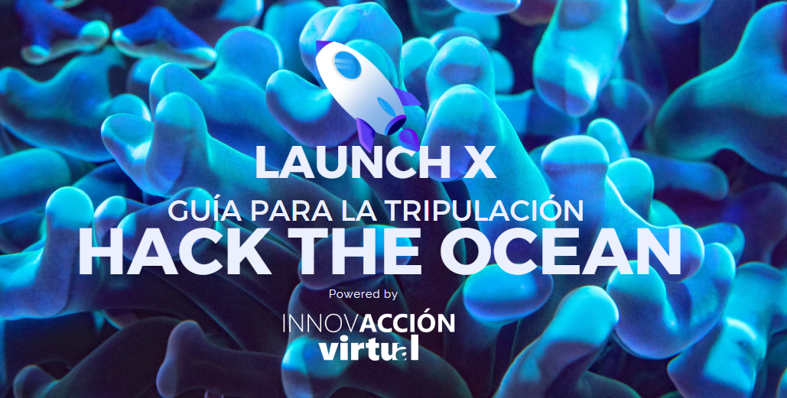
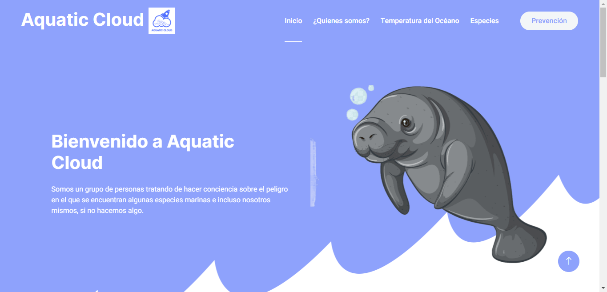
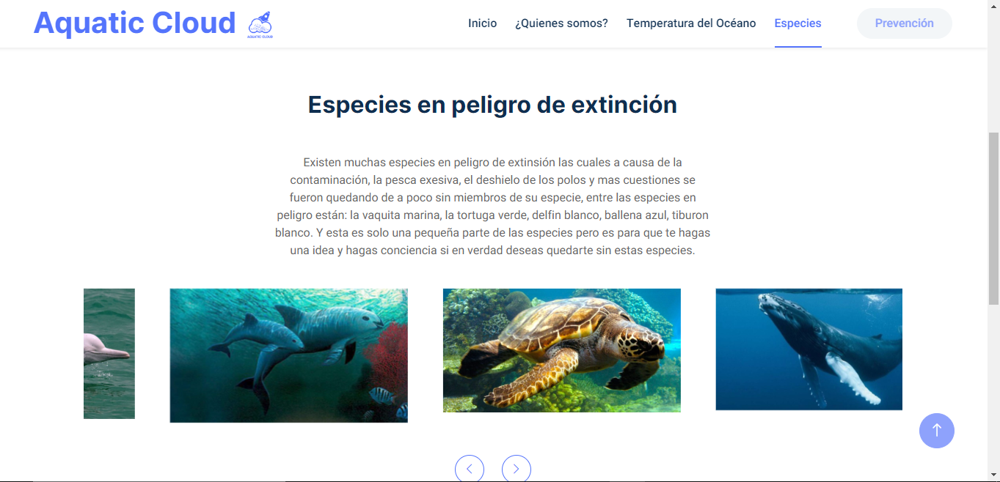
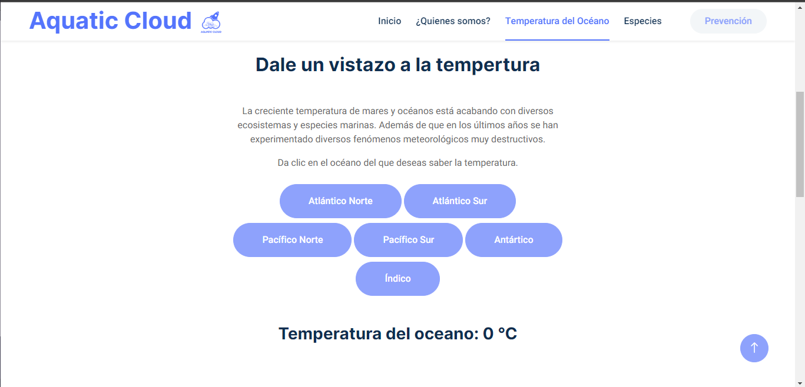
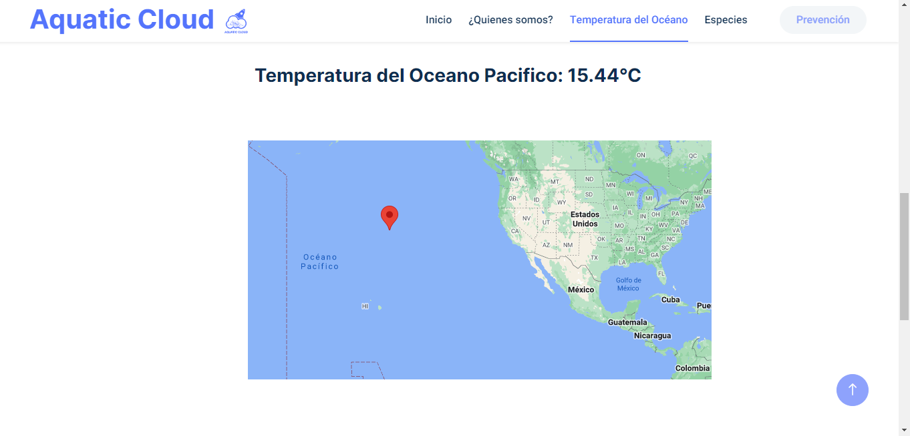
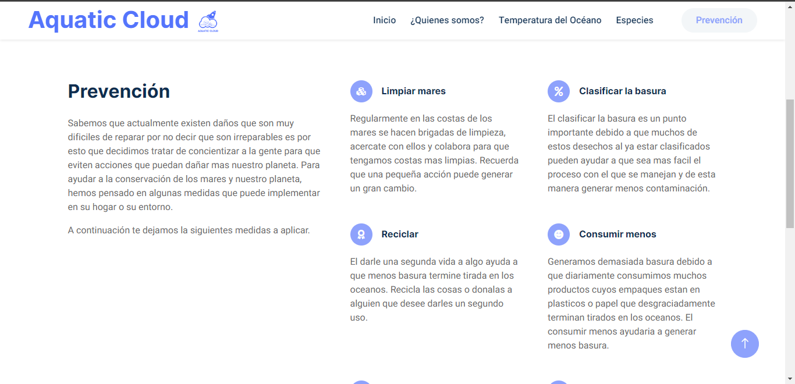
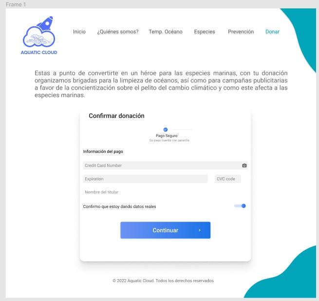

# Hackathon_Hack-The-Ocean
### Este repositorio es parte de el proyecto realizado para el Hackaton de Innovaccion virtual de Microsoft en su edicion "Hack the Ocean"
## [Link de proyecto desplejado al internet](https://aquaticclout.clousofte.com/index.html)

## Somos: El equipo Acuatiq Cloud
### Integrantes: 
* ### [Estefania Concepcion Ramirez](https://github.com/RMEstefania)
* ### [Hafid Davila Enriquez](https://github.com/Hafid-Davila)
* ### [David Lucero Sigcho](https://github.com/DavidLuceroSigcho)
* ### [Jose Antonio Mora](https://github.com/JAntonioMoraG)
* ### [Omar Duran](https://github.com/ohm10x)

## Descripcion del proyecto
Sabemos que en la actualidad el Oceano tiene bastantes problematicas las cuales vienen desde hace varios años atras, de igual manera muchas de estas problematicas son irremediables. 
Una de estos problemas que es al que nos decidimos enfocar es sobre la acidificacion del mar, quiza suene algo desconocido pero trataremos de explicar las consecuencias y sus causas. 
Este problema se genera desde fuera del oceano, precisamente con la contaminacion que los humanos generamos, esta contaminacion genera CO2 que lo que hace es que cambie el PH del agua de los oceanos y esto lo que ocaciona es que el agua se vuelva mas acida, pero ¿En que afecta que el agua sea mas acida?.

Pues lo primero es que hay especies que no estan acostumbradas a estas condiciones por lo que terminan muriendo, tambien el agua aumenta su temperatura y de igual manera causa problemas a distintas especies ademas que trae el problema del deshielo de los polos.
Como podemos ver es un problema muy grave el cual para combatirlo requiere de muchos factores, por lo que nuestra solucion es tratar de concientizar a la gente en que este problema existe, que consecuencias trae, y que pequeñas acciones pueden hacer para generar un gra cambio.

Esto por medio de una pagina Wwb en la cual se puede monitorear la temperatura de los principales oceanos del mundo ademas de mostrarnos las distintas especies en peligro de extision y una seccion donde nos dan acciones que puedes hacer para evitar que el problema se siga acrecentando 

## Capturas del funcionamiento 

## Implementaciones futuras

Este proyecto al ser realizado solo en un fin de semana se tuvieron que aplazar ideas que aunque estaban bien asentadas por cuestiones mismas del tiempo no vimos viable el implementarlas, entre las ideas principales son:
* La parte de ver la temperatura contendra un mapa donde podras seleccionar la posicion exacta donde quieres ver la temperatura
* Implementar nuestro front con VUE 
* Nuestro back implementarlo con Java incluso llevandolo a aplicaciones moviles
* Realizar una API REST donde manejaremos la informacion de las especies en peligro de extinsion, con informacion de la especie, y un contador de la misma 
* Asociarnos con las asosaciones que estan trabajando en estos problemas para que por medio de nuestra pagina puedan recibir donaciones para seguir avanzando con sus soluciones

## [Link de la pagina desplegada en azure]()

# Gracias por visitar nuestro proyecto, lo realizamos con lo aprendido en LaunchX de Innovaccion Virtual de Microsoft y esperamos que sea de su agrado.
